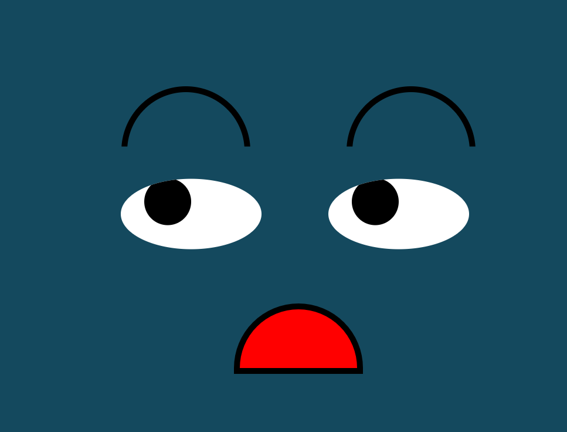

# eye-exercise
This is a homework assignment for MIT xPro web-development-javascript. 
In this exercise we create a web page with two eyes 
that follow your mouse movement.
In addition to the eyes, I added eye brows and a mouth so that it looks like a face. I will animate the mouth movement in future improvements.

## License information
MIT -Free, open source project.

# Roadmap
This project has three files: Index.html, Eyes.js, styles.css. Download these three files to a folder in your computer. Drag and drop the index file into your browser. When you move your mouse around the webpage the eyes will follow your mouse curser.

<a href="https://github.com/hicranA/eye-exercise">Eyes Exercise Repo</a> 
<a href= "https://hicrana.github.io/eye-exercise/"> Eyes Exercise</a>  

